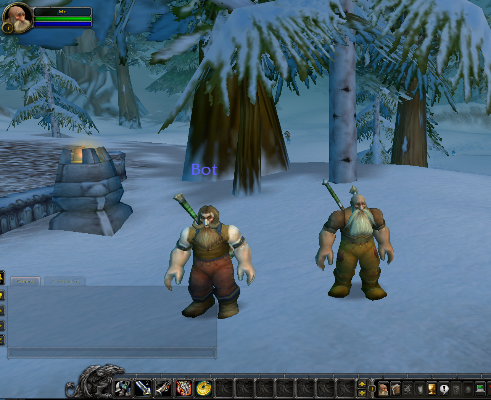

# [Abandoned] grollj (a trinity client)

A PoC of a trinity client written with Netty

## What is this
This is a PoC of a trinity client written in Java with Netty.
The goal of this code was to gain experience programming with Netty and learn about low-level network programming, understanding huge code bases (trinity) and to gain insights in real world cryptography.

This java code can connect to a Trinity (WoW) server, authenticate and spawn its character (as seen in the image below on the left).

Planned features as movement and interaction have not yet been implemented and most likely will never be.

## Usage
You need to build and run a trinity server. Note that this can take some time, plan about an hour for the build alone, depending on your hardware. Do not ignore the hints about building with debug symbols in their documentatiuon or you may end up building it again.

To be able to run, the server needs some map data from the original game. This data is not distributed with the sources but has to be extracted from an original client because of its questionable legality. There gets a tool build when compiling the server to do this. Again, this takes some time, especially the more advanced map data types (mmaps, vmaps) can take some hours.

When the server is runnable, test if you can log in with an official `3.3.5a` client.

If this works, create a user and character for the client and spawn as another client close to the "Bot" location.

When you start the client now, you will notice another character spawning. Thats it. The original goal was to implement walking around with the java client but due to a lack of time and a tricky time synchonization protocol, I refrained from implementing this.

## Will this be developed further?
Most likely not.

## Disclaimer
This program cannot be used to cheat on real WoW servers. The client is written for 3.3.5a and therefore won't work on any official servers. It won't work on most private servers either because it does not implement the Warden. Warden is an anti-cheat-system that can (to my best understanding) detect if there are any manipulated clients (like this one) or nasty programs running on the machine. The checks are not implemented and most likely will never be because it is not my intention to write a cheat program or a bot, what would not only be morally questionable but also against the EULA of Blizzard.
